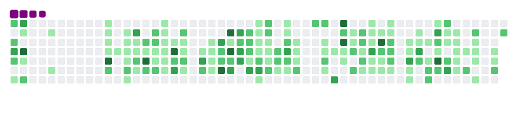

  <h1 align="center">Hi 👋, I'm Dravel IMBOLO</h1>
   <h2 align="center" style="color:rgb(255,0,0) !important; ">I'm, free for work </h2>
  <h3 align="center">
    A passionate frontend and backend developer from Congo-Brazzaville
  </h3>

  

  

    
  

  

    
  

  

  

  
Hi! I am a Full Stack web and mobile developer with a passion for code, as well as a strong background in creating, optimizing and referencing custom websites and mobile apps. Since 2018, I work as a freelancer, I also worked for 3 years part-time in a 360° communication agency. In addition to my development skills, I also have experience in community management and digital marketing, an experience justified by my certifications as well as a list of collaborations with brands for which I lead communities, implement and carry out strategies to promote them and/or their products. Whether you want to develop, optimize and/or reference your website or hire a community manager or better digitize your brand/company, I am your man, do not hesitate to contact me. I am ready to contribute my skills and expertise to contribute to the success of your projects.
  

  

  

    
  

  <h3 align="center">Connect with me:</h3>
  

    
    
    
    
  

  

    
  

  <h3 align="center">Languages and Tools:</h3>
  

    
    
    
    
    
    
    
    
    
    
    
    
    
    
    
    
    
    
    
        
    
        
  

  

    
  

   

  

    &nbsp;
  

  
   
   

